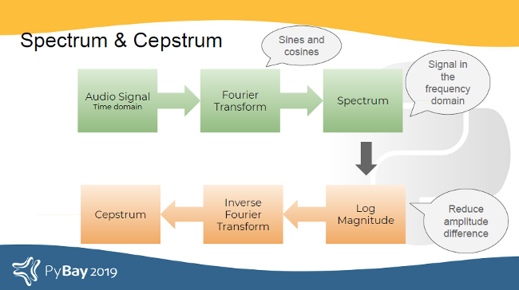
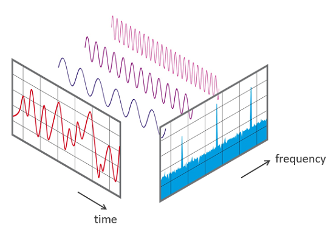
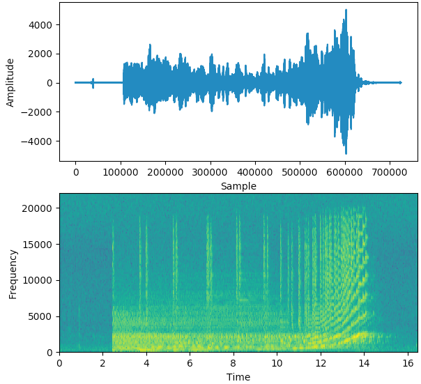
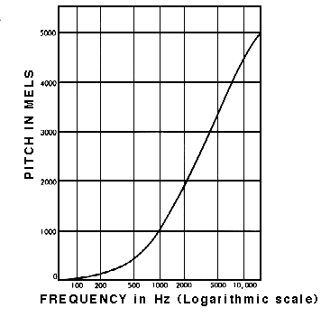
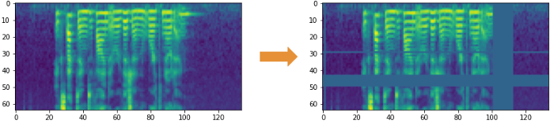
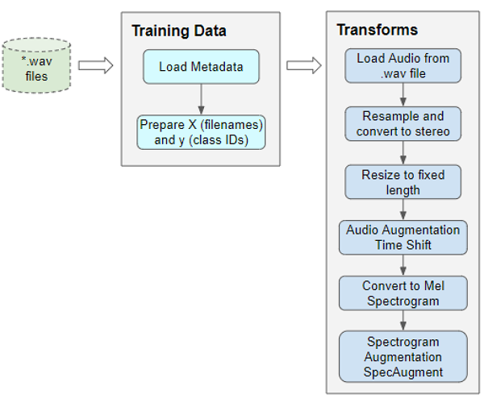

# Other Projects

### Laugh Detector from IDEO - 2018

- Uses AudioSet (https://research.google.com/audioset/) as training data.
- Uses Keras for deep learning (https://keras.io/)
- Uses librosa for audio analysis (https://librosa.org/doc/latest/index.html)

# Possible Challenges

### Reaction time/Latency might be a problem:

_source_: https://www.ideo.com/blog/why-your-office-needs-a-laugh-detector  
This article contains a video showing a demo of the laugh-detector-light-bulb. And it can be seen that there is a delay in reacting to laughter.
This might be a problem in a video conference because the laughter should be transmitted as soon as possible - to avoid reactions that aren't in sync with the actual presentation.  
**About the author**: IDEA is a global design company with over 698 employees.
(https://www.ideo.com/about)

# Audio Processing sound Theory

### Spectrum and Cepstrum

- **Spectrum**: Fourier Transform of a signal
- **Cepstrum**: log magnitude of the spectrum followed by an inverse Fourier Transform  
    
  _source_: [1]

### What is sound?

##### Basic definitions

- _period_: time taken for a signal to complete one wave
- _frequency_: number of waves made by the signal in one second
- $frequency = \frac{1}{period}$
- _audio wave_: amplitude against time
- _spectrum_: amplitude against frequency (_at one moment in time_)
- _spectrogram_: frequency against time
  - uses colours to indicated the amplitude of each frequency
  - thus, one vertical slice is equivalent to the spectrum at that time
- _Mel spectrogram_: Mel Scale against Time
  - display colours using Decibel scale (see [Human Perception](#human-perception))
- _SpecAugment_: data augmentation technique on spectrograms using frequency and time masks (cf. [Data Augmentation](#data-augmentation)
  
    
  _source_: [2a]
- _F0_: fundamental frequency
- _AC PEAK_: highest normalised cross correlation value found to determine F0
- _sampling rate [hz]_: number of samples per second

##### How do humans perceive sound?

- humans perceive frequencies on a logarithmic scale (cf. [2b])  
  
- humans perceive amplitude as loudness
  - humans perceive loudness on a logarithmic scale -> Decibel scale

# ML with Audio samples

### Typical Features

- MFCCs (Mel-frequency cepstral coefficients)

  - Spectrum -> Mel Scale Filter Bank -> Log Magnitude -> Discrete Cosine Transform -> MFCC feature
    - `Mel-filter bank` mimics human behaviour: "our ear begins to get less selective to frequencies above 1kHz"
    - Basically a reduced Mel-Spectrogram
      - covers the whole time but extracts a small set of features from the frequency domain
        - these extracted features are the ones considered to be most relevant

- GFCCs (Gammatone-frequency cepstral coefficients)
  - Spectrum -> Gammatone Filter Bank -> Downsample and loundness compression -> Descrete Cosine Transform -> GFCC feature
  - `Gammatone filter bank` mimics humans: "front-end simulation of the cochlea"

_source_: [1]

### Audio Pre-processing

##### Method

- audio pre-processing is done dynamically at runtime
  - audio data can be fairly large and memory-intensive, we don't want to load the entire dataset upfront
  - functions for transformations are defined upfront and later applied batch by batch

##### Hyper-parameter tuning

The Short-time Fourier Transform (STFT) has the following parameters:

- hop and window length for time intervals
  - on each of these segments a Fast Fourier Transform is applied
- number of bands/ranges in the frequency domain (in the Mel scale)

##### Data Augmentation

###### Spectrogram Augmentation

- _Frequency mask_: randomly mask out a range of consecutive frequencies by adding horizontal bars on the spectrogram
- _Time mask_: similar to frequency masks, except that we randomly block out ranges of time from the spectrogram by using vertical bars  
    
  _source_: [2c]

###### Raw Audio Augmentation

- _Time shift_: shift audio left/right by random amount
  - gaps can be filled with silence or a wrap around (depending on the type of sound)
- _Pitch shift_: randomly modify the frequency of parts of the sound
- _Time Stretch_: randomly slow down or speed up the sound
- _Add Noise_: add some random value to the sound

##### Pre-processing steps

1. read audio from filter
2. convert to two channels
3. standardize sampling rate
4. Audio Augmentation
   - resize to the same length
     - by padding it with silence or by truncating it
5. Convert to Mel Spectrogram
6. Spectrogram Augmentation

  
_source_: [2d]

# Definitions

- **Ontology**: "An ontology can be defined as a set of explicit narrative of knowledge models, encompassing common concepts, their principles, and the relation between those concepts."

  - source: https://www.innoplexus.com/blog/understanding-ontology-for-better-insight-into-the-life-sciences-data-ocean/

- **AED** = Audio Event Detection
- **prosodic** = relating to the rhythm and intonation (= the way a speaker's voice rises and falls)

# Real-time factors to consider

- frame size (inlc. context window)
  - the larger the minimum frame size (incl. context window), the higher the latency
  - the context window in the past is easy, tricky for the future
    - the longer the context in the future has to be, the higher the latency
      - i.e. we need to wait until this context has passed
- computational power of the device
  - e.g. assuming the algorithm should run on a clients machine, one can't require the power of a GPU
- feature extraction and classification
  - the more complex the model -> the higher the latency
  - the more complex the features -> the higher the latency
    - feature extraction here includes preprocessing applied (like transformation to frequency domain)
- min_length parameter of the model (minimum laugh segment length)
  - if set to 0.2 we have a minimum latency of 0.2

**practical considerations**

- use a buffer to store audio data until classification is finished
  - otherwise, one will loose audio data during the processing time
- the latency applies at the beginning and at the end
  - assume latency L
    - start is delayed by L -> missing relevant audio
    - end is delayed by L -> streaming irrelevant audio

# Sources

### Audio Processing Theory

[1]: https://opensource.com/article/19/9/audio-processing-machine-learning-python#comments
[2a]: https://towardsdatascience.com/audio-deep-learning-made-simple-part-1-state-of-the-art-techniques-da1d3dff2504?gi=5e61000ae4ee
[2b]: https://towardsdatascience.com/audio-deep-learning-made-simple-part-2-why-mel-spectrograms-perform-better-aad889a93505
[2c]: https://towardsdatascience.com/audio-deep-learning-made-simple-part-3-data-preparation-and-augmentation-24c6e1f6b52
[2d]: https://towardsdatascience.com/audio-deep-learning-made-simple-sound-classification-step-by-step-cebc936bbe5

### Laughter

- 2 years ago: laughter detection: https://github.com/jrgillick/laughter-detection
  - corresponding blog post: https://www.ideo.com/blog/why-your-office-needs-a-laugh-detector
- 4 years ago: laughter detection: https://github.com/ganesh-srinivas/laughter

### Applause

- Seems to be non-trivial - no single frequency
  - https://sound.stackexchange.com/questions/25481/filter-applause-from-videos
- Paper(2009) about applause filtering - proposed model computationally efficient
  - https://www.researchgate.net/publication/220226738_Characteristics-based_effective_applause_detection_for_meeting_speech
  - https://www-sciencedirect-com.ezproxy.is.ed.ac.uk/science/article/pii/S0165168409000759
