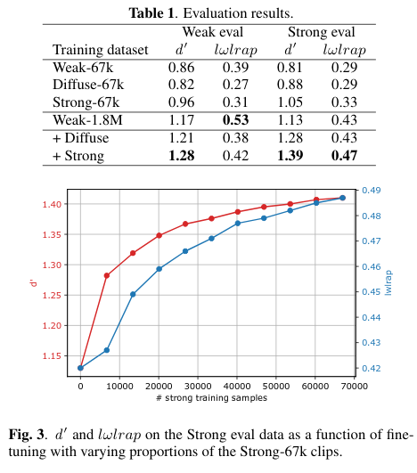
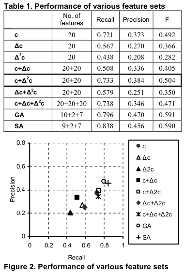
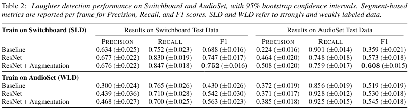
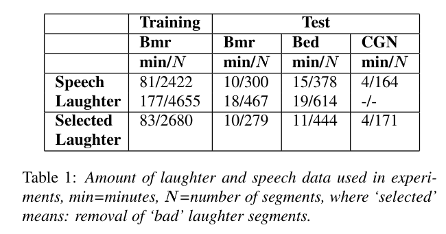
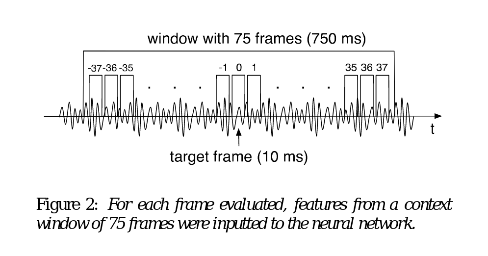

# Reserach Review

# General Papers

### CNN Architectures For Large-Scale Audio Classification - 01/2017

_source: https://arxiv.org/pdf/1609.09430.pdf_

**Possibly use CNN Architecture for our classification problem**

Quote from intro:
AED = Audio Event Detection

> Historically, AED has been addressed with features such as
> MFCCs and classifiers based on GMMs, HMMs, NMF, or SVMs
> [8, 9, 10, 11]. More recent approaches use some form of DNN,
> including CNNs [12] and RNNs [13].

- using Youtube-100M
- 70M vids - 5.24M hours
- 30K labels

- whole soundtrack classification
  - assign one keyword to a whole video

---

### The Benefit Of Temporally-Strong Labels In Audio Event Classification

_source: https://arxiv.org/abs/2105.07031_

-uses https://research.google.com/audioset/download_strong.html dataset

- which describes clips of varying length - manually chosen by annotators
- whole eval set and 5% of the training set - chosen at random
- conclusion states that a classifier trained on the large 'weakly-labeled' dataset can be improved via-fine-tuning
- evaluations were on fixed-size frames
  - but strong labelling suggests directly predicting the segment boundaries  
     
    -> that's interesting for us!
    

---

# Applause

### Novel approach for detecting applause in continuous meeting speech - 2011

_source: https://ieeexplore-ieee-org.ezproxy.is.ed.ac.uk/document/5941827_

> The proposed approach is based on the short - time autocorrelation
> function features - decay factor, first local minimum
> and band energy ratio.

- 4 features with thresholds
- compared conventional method using mel frequency cepstral coefficients (MFCC) feature vectors and GMM as classifier
  - 36 feature vector 12 of the 13 MFCC and their first and second derivative
- dataset: 4 hours 37minutes of meeting speech -**unpublished**

| method       | precision rate | recall rate | F1 score |
| ------------ | -------------- | ----------- | -------- |
| proposed     | 94.40%         | 90.75%      | 92.54%   |
| conventional | 67.47%         | 96.13%      | 79.29%   |

---

### Heterogeneous mixture models using sparse representation features for applause and laugh detection - 2011

_source: https://ieeexplore-ieee-org.ezproxy.is.ed.ac.uk/stamp/stamp.jsp?tp=&arnumber=6064620_

- first read doesn't convince me
  - it's already 10 years old and the technique is likely deprecated
  - **dataset unpublished**
    - quality of data unclear
    - 20 hours of video (from Youku) in total
    - but only ~1.77h in DB if all segments are 8s long:
      > The database includes 800  
      > segments of each sound effect. Each segment is about 3-
      > 8s long and totally about 1hour data for each sound  
      > effect. All the audio recordings were converted to
      > monaural wave format at a sampling frequency of 8kHz
      > and quantized 16bits. Furthermore, the audio signals  
      > have been normalized, so that they have zero mean  
      > amplitude with unit variance in order to remove any  
      > factors related to the recording conditions.

---

### Applause Sound Detection - 2011

_source: https://www-aes-org.ezproxy.is.ed.ac.uk/tmpFiles/JAES/20210927/JAES_V59_4_PG213hirez.pdf_

- very small dataset - 1.75h if all snippets were 30s... - **unpublished**
  > The data set for training and test comprises 210
  > excerpts of commercial recordings of between 9- and 30-
  > second length each.
- real-time detection with low latency!
   - that's interesting for us!
  

**Confusion Matrix**: binary classification using MFCC and LDD + delta and sigma features
| | Predicted Applause | Predicted No |
|---| ---| ---|
| Applause | 83 | 2|
| No Applause | 3 | 12 |

- best performance using a combination of MFCC and LLD(low-level descriptors)
  - using MLP (Multilayer Perceptron) and SVM with radial basis functions
- recognises 95% of applause correctly

---

### Characteristics-based effective applause detection for meeting speech - 2009

_source: https://www-sciencedirect-com.ezproxy.is.ed.ac.uk/science/article/pii/S0165168409000759/pdfft?md5=b6f3199e457436e57db04012f64a90a3&pid=1-s2.0-S0165168409000759-main.pdf_

- uses decision tree instead of complex statistical model

  - faster decisions possible
  - interesting for our problem

- Data: 50h of meeting speech (multi-participant)
  - **not published**

| Parameters               | proposed algor. | traditional algor. |
| ------------------------ | --------------- | ------------------ |
| Precision                | 94.34           | 91                 |
| Recall                   | 98.04           | 94.12              |
| F1 - measure             | 96.15           | 92.53              |
| Computational Time (min) | 59.4            | 92.5               |

---

### Discriminative Feature Selection for Applause Sounds Detection

_source: https://ieeexplore.ieee.org/stamp/stamp.jsp?tp=&arnumber=4279120_

- doesn't convince me - the improvements don't seem that relevant to me
  

# Laughter

### Robust Laughter Detection in Noisy Environments - 09/21

_source: https://www.isca-speech.org/archive/pdfs/interspeech_2021/gillick21_interspeech.pdf_

- Update on the original paper:
  - **Capturing, Representing, and Interacting with Laughter (2018)**
    - https://dl.acm.org/doi/pdf/10.1145/3173574.3173932
  - trained on Switchboard dataset
  - more general, exploring interaction with laughter - qualitative
    > This work contributes a qualitative evaluation of our prototype
    > system for capturing, representing, and interacting with laughter.
- Augmentation of AudioSet:
  - https://github.com/jrgillick/laughter-detection/tree/master/data/audioset
  - 148 minutes of audio
    - 58min of laughter -> 1492 distinct laughter events
- evaluated on both Switchboard and augmented AudioSet
- uses new dataset on top of AudioSet corpus
  - with precise segmentations for the start and end points of each laugh
- prior work performs badly in noisy environment

- predictions are made using a one second sliding window
  - fps=43.1 => ~23ms frames
    found this to perform slightly better than fps=100 => 10ms frames

- How noisy do we expect the input of our domain to be?
  - Each input is separate
  * poor mic quality
  * background noise in the home office

- AudioSet only specifies _"laughter occurred in this 10sec snippet"_ but not where
- Results suggest that finely-segmented and in-domain data annotations are important
  - without the new finely-segmented annotation of the AudioSet data the results aren't as good

---

### Corine A Bickley and Sheri Hunnicutt. Acoustic analysis of laughter. InICSLP,volume 51, pages 52–55, 1992.

- _source: https://www.ee.columbia.edu/~dpwe/papers/BickH92-laugh.pdf_

- motivation: separating speech from non-speech for speech recognition algorithms
  - especially focusing on sounds acoustically close to speech
- doesn't consider co-occurrences of laughter and speech

- **Goal**: Examine a small set of laughter vs. speech (2 subjects) thoroughly

- **Measures used**

  - duration
  - Fundamental frequency
  - difference in amplitude of lowest harmonics
  - spectral peaks
  - waveform periodicity
  - waveform amplitude

- laugh syllable: unvoiced segment followed by voiced segment
- laugh: sequence of laugh syllables

- Results:
  - ration of unvoiced to voiced duration is higher (1.7 and 2.3)
    - spoken english has 0.5
  - more low-frequency voicing in periodic portions
    - noise in the region of the third formant

---

### L. S. Kennedy and D. P. Ellis, “Laughter detection in meetings,” in Proc. NIST ICASSP Meeting Recog. Workshop, Montreal, Canada, 2004, pp. 118–121

- _source: https://academiccommons.columbia.edu/doi/10.7916/D8JD565R_
- _[GS-Ranked 1st "laughter detection"]_

- uses ICSI, CMU, NIST and LDC corpus
- Bmr subset of ICSI corpus
  - using just the two table-top microphones
  - Training-set: first 26 Bmr-meeting
  - Test-set: last 3 Bmr-meetings
- split data into 1s non-overlapping snippets
- laughter-event defined when multiple people laugh at once
  - different to ours
- data split into 1sec windows
- Features tried:
  - MFCCs
  - delta MFCCs
  - modulation spectrum
    - _idea_
      > trying to catch the coarse repetition of vowel sounds, which is characteristic of most laughter.
  - spatial cues
    - _idea:_ the signal direction won't be consistent during multi-participant laughter segments,
      whereas it should be mostly consistent during single-speaker, non-laughter segments
- Discrimination: SVM
- **Best Performance:** MFFCs
  - only using first 6 of MFCCs gives same performance to all 13 coefficients
  - Recall: 87%
  - False Alarm Rate: 13%
- percentage of people laughing is highly correlated to distance from SVM decision boundary
  - possibility to use 'certainty' of classification as predictor of the intensity of the laughter event
- good performance on CMU and NIST recordings
- bad performance on LDC recordings - WHY COULD THAT BE?

---

### K. P. Truong and D. A. Van Leeuwen, “Automatic detection of laughter,” in Proc. 9th Eur. Conf. Speech Commun. Technol., 2005, pp. 485–488.

- _source: http://lands.let.ru.nl/literature/leeuwen.2005.3.pdf_

- uses ICSI Meeting Cor-pus and the Dutch CGN corpus

  - Training-set: first 26 Bmr-meeting
  - Testing-sets:

    1. Last 3 Bmr-Meetings (same speakers as training data)
    2. 4 Bed Meetings (different speakers compared to training data)
    3. Dutch CGN corpus

- Preprocessing on ICSI:

  - started with all events transcribed as laughter
  - manually discarded 'bad laughter'-events (co-occurrence with speech, non-audible)
    - done by 1 person

  

- looks at 'paralinguistic events' for classification of speaker's emotinoal state
  - laughter was annoted most often -> thus, focus on laugher detection
- features tried:
  - PLP (Perceptual Linear Prediction) -> **Best Performance**
  - per frame - pitch & energy
  - global - pitch & voicing
    - **Promising** because pretty good performance with only 6 features per segment
    - suggests further research to possibly combine this with PLP
  - modulation spectrum features
- Discrimination: GMM (Gaussian Mixture Models)

- works on predefined segments with binary output (contains laughter/does not contain laughter)
  - suggests HMMs for laughter detection with automatic detection of boundaries

---

### Truong, K. P., & Van Leeuwen, D. A. (2007). Automatic discrimination between laughter and speech. Speech Communication, 49(2), 144-158.

- _source: https://www.sciencedirect.com/science/article/pii/S0167639307000027_
- follow-up of the paper above

- uses ICSI Meeting Cor-pus and the Dutch CGN corpus
  - segments average duration: ~2s
- Training-set: First 26 Bmr-Meetings from ICSI corpus
- Testing-sets:

  1. Last 3 Bmr-Meetings (same speakers as training data)
  2. 4 Bed Meetings (different speakers compared to training data)
  3. Dutch CGN corpus

- long-term goal: Emotion classification
  - laugh detector is one step towards that
- Features tried: spectral(=relating to the amount of vibration at each individual frequency) and prosodic(=relating to the rhythm and intonation)
- Discriminators: GMM, SVM and MLP

- mentions possibility of gender and cultural discrimination
- used segments of ONLY laughter or ONLY speech

- performs well (EER < 10%) on CGN (desktop recordings in Dutch) even though it's trained on ICSI (close-talk mic per speaker in English)

---

### M. Knox, “Automatic laughter detection Using Neural Networks” Univ. California, Berkeley, CA, USA, Final Proj. EECS 294, 2006.

- _source: http://www.icsi.berkeley.edu/pubs/speech/laughter_v10.pdf_
- _[GS-Ranked 2nd "laughter detection"]_
- uses ICSI database

  - Bmr subset of the corpus

    - like "Kennedy and Ellis" and "Truong and van Leeuwen"
    - Training-set: first 26 Bmr-meeting
    - Test-set: last 3 Bmr-meetings

  - Preprocessing on ICSI

    - only consider laughter-only segments

      > Laughter-colored speech, that is, cases in which the hand transcribed documen-
      > tation had both speech and laughter listed under a single start
      > and end time were disregarded since we would not specifically
      > know which time interval(s) contained laughter.

    - exclude audio where there was no transcription available for that channel

      > ideally an automatic silence detector would be deployed instead of relying on the transcripts

    - unlike Truong and Van Leeuwen, kept audio that contained non-lexical vocalised sounds other than laughter

  > we hope that our work serves as a baseline for future work on
  > frame-by-frame laughter recognition on the Meetings database,
  > which provides an excellent testbed for laughter research

  - states that ICSI db is a good testbed for laughter research

- good introduction mentioning both Kennedy and Truong
- goal: examine the many uses of laughter in the future

- First tried using an SVM similar to Kennedy and Ellis

  - for that one has to store feature statistics (mean and standard deviation) over a fixed segment length
  - need to decide on offset (segment length)
    - determines precision of boundaries
  - First try: offset = 0.5s
    - calculate stats over 1s segments
    - 9% EER
  - Second try: offset = 0.25s
    - calculate stats over 1s segments
    - 8% EER
    - significantly more compute time + storage space needed
  - Third try: offset = 0.25
    - calc stats over 0.5s segments
    - 13 EER => segment over which stats are calculated influences performance
  - _Downsides of SVM_
    - parse data into segments
    - calculate and store statistics of raw features to disk
      - mean and standard deviation of raw features (MFCCs, delta MFCCs, modulation spectrum, and spatial cues)
    - poor resolution of start and end times

- _Neural Network_

  - can use raw data (e.g. MFCCs) for each frame as feature (no aggregation needed)

- **Data used**
- Features tried:
  - MFCCs
  - fundamental frequency
  - rms frequency
  - ac peak
- Discrimination: NN with 1 hidden layer

- **Best Performance:** MFCCs + ac peaks (combined)

  - The best system achieved an Equal Error Rate (EER) of 7.91\%.

- **Questions:**
  - what are deltas and delta-deltas?
    - first and second derivative, respectively

---

### Laughter and Filler Detection in Naturalistic Audio - 2015

_source: https://utd-ir.tdl.org/bitstream/handle/10735.1/5058/JECS-3626-4639.10.pdf?sequence=1&isAllowed=y_

- proposes a simpler approach with features that are a combination of spectral features and pitch information
  - a CNN runs on top for classification

---

### Quantitative Laughter Detection, Measurement, and Classification—A Critical Survey (2016)

_source: https://ieeexplore-ieee-org.ezproxy.is.ed.ac.uk/stamp/stamp.jsp?tp=&arnumber=7403873_

- _[GS-Ranked 6th "laughter detection"]_

> laughter as a multimodal social and emotion expression behaviour  
> _(taken from conclusion)_

> but unfortunately, a comprehensive theory of laughter has
> not yet been developed.
> _(taken from conclusion)_

> The possibility to detect, analyze, and classify
> laughter can lead to progress in a variety of fields, from medicine
> [12]–[20], [23] and psychology [7]–[10] to robotics [45], [46].
> _(taken from introduction)_

> The purpose of this survey is to bring together the different
> results obtained in different fields, to both present all the possible
> methods to quantify laughter and try to draw a comprehensive
> physiological model of this complex human behaviour.
> _(taken from introduction)_

> The best performances—from 70% to 90% correct
> classification rate—have been obtained using Mel-frequency
> cepstral coefficients and perceptual linear prediction over stan-
> dard audio spectrum features, and combining classifiers that
> use both spectral features and prosodic information. This is not
> very surprising as laughter is tailored on the human hearing
> apparatus.

> In addition, even if audio and video data based systems are
> generally the most ecological, as they allow to monitor subjects
> moving and interacting freely, these systems can raise privacy
> concerns, especially in the case of applications for laughter
> aware intelligent machines and interfaces. Individual wearable
> systems using body movement data, relying on well-established
> body movement-emotional state models, can help addressing
> these concerns.

- I understand this argument but disagree because wearable sensors are quite inconvenient and intrusive

- more general reflection on the state of research back then
- suggests the use of multimodal works combining studies on acoustic analysis, with the ones on respiratory and physiological changes as well as the ones on facial expression
- talks quite a bit about applications and less technical facts

---

# Other possible resources

### Need to read

_Papers cited but not yet read in detail:_

- Corine A Bickley and Sheri Hunnicutt. Acoustic analysis of laughter. InICSLP,volume 51, pages 52–55, 1992.
  - https://www.ee.columbia.edu/~dpwe/papers/BickH92-laugh.pdf

### Videos

- Youtube video series on Audio Signal Processing for ML
- https://www.youtube.com/watch?v=iCwMQJnKk2c&list=PL-wATfeyAMNqIee7cH3q1bh4QJFAaeNv0

### Other possible Papers

- Getting the last laugh: Automatic laughter segmentation in meetings - 2008
  - https://scholar.google.com/citations?view_op=view_citation&hl=en&user=2FtK1gUAAAAJ&citation_for_view=2FtK1gUAAAAJ:UebtZRa9Y70C
  - uses ICSI Meeting Recorder Corpus
  - 78.5% precision rate and 85.3% recall rate
    - not better than other papers listed
- Improved Audio-Visual Laughter Detection Via Multi-Scale Multi-Resolution Image Texture Features and Classifier Fusion

  - https://ieeexplore.ieee.org/abstract/document/8461611
  - _Can we use the audio analysis separately from the video?_
  - uses MAHNOB db

- Highlight sound effects detection in audio stream

  - https://ieeexplore.ieee.org/abstract/document/1221242
  - _Could mention that in background chapter as another use of laughter detection in the past_
  - used HMM

- Bachorowski, J. A., Smoski, M. J., & Owren, M. J. (2001). The acoustic features of human laughter. The Journal of the Acoustical Society of America, 110(3), 1581-1597.

  - https://asa.scitation.org/doi/abs/10.1121/1.1391244
  - apparently also mentions gender issue

- Ohara, R., 2004. Analysis of a laughing voice and the method of laughter in dialogue speech. Unpublished Masters Thesis, Nara Institute of Science and Technology.
  - distinguishes different types of laugh in Japanese
  - COULD BE A STRETCH GOAL FOR THE PROJECT -> FOLLOW UP ON THE PROJECT

---

# Evaluation Metrics

### Possible Papers:

- Metrics for Polyphonic Sound Event Detection
  - https://www.mdpi.com/2076-3417/6/6/162

# Realtime and computational factor

### Efficient Convolutional Neural Network For Audio Event Detection - 2017

- _Link:https://arxiv.org/pdf/1709.09888.pdf_

- reduces memory requirement by a factor of more than 500
- reduces computational effort by a factor of 2.1
- only classifies every 4 seconds

  - too slow for us -> but one can tweak this

- **TODO**: look at structure in more details, seems promising

---

### Low-Latency Real-Time Meeting Recognition and Understanding Using Distant Microphones and - 2012

- _Link: https://ieeexplore.ieee.org/stamp/stamp.jsp?tp=&arnumber=5983476_

- they use distant microphones
- latency for audio processing is less than two seconds

  - 1.2 for dereverberation
  - 64ms for separation and diarization
  - 10ms for noise supprssion

### OTHER

- Two-Source Acoustic Event Detection And Localization: Online Implementation In A Smart-Room

  - https://ieeexplore.ieee.org/stamp/stamp.jsp?tp=&arnumber=7074224

- Teacher-Student Training For Acoustic Event Detection Using Audioset
  - https://ieeexplore.ieee.org/stamp/stamp.jsp?tp=&arnumber=8683048

# Projects

### Sound Event Classification (incl. ~real time)

_Link: https://github.com/chathuranga95/SoundEventClassification_

### IDEO Laughter Project (2018)

_source: https://www.ideo.com/blog/why-your-office-needs-a-laugh-detector_

- used AudioSet
- 87% accuracy with LSTM model

  > applying batch normalization to the LSTM input was very
  > important for getting the model to converge  
  > -> got this insight from https://github.com/ganesh-srinivas/laughter/ (2017)

- chose LSTM over logistic regression model because LSTM was able to handle variable length input
  - logistic regression needed same input length as training data, namely 10s snippets

# Misc

### Talks

- "Optimized time series filters for detecting laughter and filler events"
  - link: http://publicatio.bibl.u-szeged.hu/14571/7/3311351_cimlap_tartj.pdf
  - **Can I get access to this talk?**

### Observation

There are quite a few papers using **audio-visual** detectors, meaning they combine the results of a separate audio and video classifier

- Not desirable for our project
  - complexity
  - privacy implications

**Examples:**

- Berker Turker, Bekir et al. “Audio-Facial Laughter Detection in Naturalistic Dyadic Conversations.” IEEE transactions on affective computing 8.4 (2017): 534–545. Web.
- Studies from Koc University Provide New Data on Affective Computing (Audio-Facial Laughter Detection in Naturalistic Dyadic Conversations). NewsRX LLC, 2018. Print.
- Petridis, Stavros, Brais Martinez, and Maja Pantic. “The MAHNOB Laughter Database.” Image and vision computing 31.2 (2013): 186–202. Web.
  - _corresponding corpus_
- S. Petridis and M. Pantic, “Audiovisual laughter detection based on temporal features,” in Proc. 10th Int. Conf. Multimodal Interfaces, 2008, pp. 37–44.
  - _[GS-Ranked 5th "laughter detection"]_

### Questions

- Which paper first used CNNs instead of other techniques for audio classification?
- How much should I talk about the history of audio processing in general?
  - include a few more general papers on AED(Audio Event Detection)
  - however, focus on what's relevant for this project
- If applause snippets are group actions, might that be a problem for our usecase?
- what are delta and sigma features?
  - delta features are the derivates
- How do we address gender differences?
- Should we also remove 'bad-laughter' segments from ICSI like Truong and Van Leeuwen?
- How detailed does my understanding of audio processing theory have to be
  - e.g. as explained in this article: https://blog.paperspace.com/introduction-to-audio-analysis-and-synthesis/
