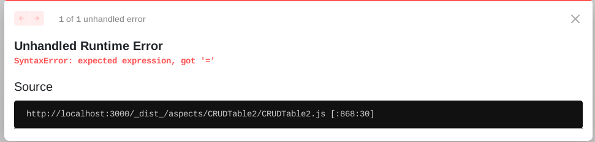

# Setup Notes
_Things I realised during the local setup of clowdr_

## General
- What does BCP mean: "Best Current Practice" ?
- for me it wasn't clear that you should only do the pre-requisites section on each subpage
  - I started with the setup of the different parts straight away which led to a bit of confusion later on
    - I naively thought that the setup was part of the pre-requisites for later setup steps
  - maybe there is a way to make it clearer that the pre-requisite links are
    only supposed to link the top section of each subpage

## Steps
#### General Setup (main README)
#### ***Step 3**
- building the slate-transcript-editor creates the dist folder but also creates a .diff file
  - should this .diff file (slate-transcript-editor.diff) be added to the .gitignore or should it just be ignored?
- there are also some changes in the package-lock.json after building 
  - can this just be ignored? 
- If you run into errors you don't understnd it might be worth to reinstall the node_modules
  - delete the `node_modules` folder and run `npm i` to reinstall modules

---
#### Specific Setups (sub README pages)
#### **Hasura Setup**
- change docker command to docker-compose

- if you are connected to a **VPN** you need to disconnect to connect to local services
  - or reroute LAN traffic to local gateway
- Mostly works on second try if it hasn't run before
  - this isn't critical but not ideal 

#### **Clowdr: Actions Service**
- which video codec format should I use for my Vonage Video API Account? (VP8 or H.264)
  - from the code I assume H264 (clowdr/services/playout/src/channel-stack/channel-stack/channelStack.ts)
- GRAPHQL_API_SECURE_PROTOCOLS says default _true_ but it's _false_
- Order Env-variables according to env file or alphabetically? 
  - e.g. SENDGRID_API_KEY and SENDGRID_SENDER are in a different position than in the env file
- Quick Setup: what about the GOOGLE CLOUD and SENDGRID variables? 
  - should they be `XXXX` as well? 
- Do I need to run `Actions service - GraphQL Codegen` for quick setup as well? 
- I didn't set the `AUTH0_API_DOMAIN` after completing the setup
  - is there a step telling you to do that after you configured AUTH0? 
  - same applies to the `realtime service`
- Action service QUICK SETUP doesn't work until now
  - it seems like the AWS configs are necessary for it to work
- Problem in `package.json` - **ERROR**: `missing script: build` - most likely because it's not executed with the correct prefix

  - replacing `--prefix=../../ --workspace=shared` with `--prefix=../../shared` solved the problem

- **Error I ran into:**
  - If there are Errors about missing modules:
    - delete the `node_modules` folder and run `npm i` to reinstall modules
  - it seems like some files depend on generated code, namely "generated/graphql"
  - these files seem to be called during the `Actions service - GraphQL Codegen` task
    - since the code hasn't been generated an error is thrown
  - **FIX**: Restart whole setup and run task again 
    - docker-compose down
    - then run `Hasura Console -- Local Development task` (which also runs docker-compose)
    - then run `Actions service - GraphQL Codegen`

#### **Clowdr: Realtime Service**
- RABBITMQ_USERNAME:PASSWORD as `guest:guest` seem to work while the default one (services/realtime:1234) throws the following error
  -`"ACCESS_REFUSED - Login was refused using authentication mechanism PLAIN. For details see the broker logfile."`
- Problem in `package.json` - **ERROR**: `missing script: build` - most likely because it's not executed with the correct prefix
  - replacing `--prefix=../../ --workspace=shared` with `--prefix=../../shared` solved the problem

#### **Clowdr: Playout Service**
- example.env: 
  - EVENT_SECRET would be better as `XXXXX` instead of `XXXXY`
- **Error**: `Cannot find module '@nestjs/schedule' or its corresponding type declarations.`
  - installing it manually solved the problem: `npm i @nestjs/schedule`
  - why is it not automatically installed?  
- If there are Errors about missing modules:
  - delete the `node_modules` folder and run `npm i` to reinstall modules

#### **Clowdr: Frontend**
- seems like `snowpack` needs to be installed globally for npm start to work
- Problem in `package.json` - **ERROR**: `missing script: build` - most likely because it's not executed with the correct prefix
  - replacing `--prefix=../../ --workspace=shared` with `--prefix=../shared` solved the problem
- **Error I ran into**: 
  - `[snowpack] Package "class-transformer" not found. Have you installed it? `
  - `Error: Cannot find module memory-fs/lib/join`
    - Fix: installed memory-fs manually with npm
  - `Error: Cannot find module ajv-errors` 
    - `npm i ajv-errors` throws dependency error
    - Running it with `--force` leads to the following Error:
      - `TypeError: Cannot read property 'allErrors' of undefined`
      - Removing the node_modules folder and running `npm i` solved the issue
  - `System limit for number of file watchers reached, watch '/home/lasse/Programming/Uni/Honours_Project/clowdr/frontend/node_modules/@ahanapediatrics/ahana-fp'`
    - solved by FIX from https://github.com/gatsbyjs/gatsby/issues/11406
      - `echo fs.inotify.max_user_watches=524288 | sudo tee -a /etc/sysctl.conf && sudo sysctl -p`

#### **Expose local services at a public URL**
- `"Copy the auth URL (http://<hasura-domain>/v1/graphql) into the HASURA_URL Auth0 Rule Configuration as shown in step 5."`
  - which step 5? 
    - **STEP 5 of the Auth0 setup**

#### **pktriot**
- If you only have the FREE pktriot plan `pktriot start` won't work because you only have one port per tunnel and the setup (`pktriot.json`) defines 3 ports

- If you try to start pktriot with only prior steps completed you get the following error:
  `{"status":false,"errror":"invalid accept value in request"}`
  - **FIXED** There was a mistake in the `pktriot.json`

#### **Auth0 Setup**
- _! Create own README for this bc it's too long for the main README !_
  - and it can be confusing when the section ends
    - I was looking for a VSCode extension because I thought step 6 belonged to the general README again
- For all configured URLs the trailing comma in the last line, needed to be removed for Auth0 to accept the input
  - e.g.: 
    > http://localhost:3000/auth0/,  
    > http://localhost:3000/auth0/logged-in,  
    > http://localhost:3000/auth0/email-verification/result **,** <- this comma

- `Rule` Tab is now in the sidebar under `Auth Pipeline/Rules`
- There are two step 1s under `4. Create Rules`

#### **AWS Setup**
- seems like `clowdr/openShotKeyPairName` config-variable needs to be configured after the corresponding EC2 instance was created
- trailing comma in the last line of `cdk.context.json.example`  
- **Error** Running: `cdk deploy --all`:
> node:internal/modules/cjs/loader:927  
>   throw err;  
>   ^  
>   
> Error: Cannot find module 'source-map-support/register'  

  - **Fix:**
    - 1) I didn't have a node version > 16.00 installed as required by the main README
    - 2) Then there was a conflict with node versions on my computer
    - 3) after resolving that and reinstalling the node_modules the error was gone 

---
- **Error** when running `cdk deploy --all`:
> 12:54:06 | CREATE_FAILED        | AWS::IAM::Policy                    | ActionsUserDefaultPolicy3D391E22  
> Maximum policy size of 2048 bytes exceeded for user midspace-dev-main-ActionsUser91FDA86E-1PC0IVK9QJVWZ (Service: AmazonIdentityManagement; Status Code: 409; Error Code: LimitExceeded; Request ID:  
> 30d927af-3c36-4e57-892b-27a36be23f09; Proxy: null)  

- **Fix:** 
  - The relatively long stack-prefix midspace-dev pushed the policy over the limit. Quick fix for now: use a shorter prefix like mids .
  - A refactor of the code is currently worked on and will eliminate this problem in the future.

##### _Section: Deploying the image handler_  
- Creating the stack from the template throws following error:
`The following resource types are not supported for resource import: AWS::CDK::Metadata,AWS::IAM::Policy,AWS::S3::BucketPolicy,AWS::IAM::Policy,AWS::IAM::Policy,Custom::CustomResource,Custom::CustomResource,Custom::CustomResource,Custom::CustomResource,Custom::CustomResource,Custom::CustomResource,AWS::S3::BucketPolicy,Custom::CustomResource,AWS::ApiGateway::Account,AWS::Lambda::Permission,Custom::CustomResourceLearn more`
  - **FIX** You need to choose Create stack `With new resources` NOT `with existing resources`
- what is the `content bucket` supposed to be? 
  - can I just create a new S3 bucket for this?
  - **No** it was created by the cdk-deploy -> make that clearer in the instructions
- **Error** when creating stack: `Requires capabilities : [CAPABILITY_NAMED_IAM]`
  - just check the tick box at the bottom of the screen :D 

## How to run Local Setup after initialisation
1) Run `Hasura Console -- Local Development` task
- _Your browser should have opened a tab to the Hasura console_

2) Open http://localhost:15672 in a web browser and log in with the default username and password, both admin.
  - Now, create the user that the realtime service will use to access RabbitMQ. Go to the Admin tab and add a new user with username services/realtime and password 1234. Click the username of the newly-created user, and then click the Set Permission button. This gives the user unrestricted read/write access.

## Questions 
- On the hasura url that is published via pktriot it says:
  -> resource does not exist
- That's because hasura's graphql endpoint only accepts POST requests

## Comment on Quick Setup
- I got the quick setup working up to the following state
  - all services are running except for the `Actions-Service`
    - it throws the following error:
>     > npx foreman start --procfile ./Procfile -p 3001  
>   
> 15:16:39 web.1   |  node:assert:402  
> 15:16:39 web.1   |      throw err;  
> 15:16:39 web.1   |      ^  
> 15:16:39 web.1   |  AssertionError [ERR_ASSERTION]: CORS_ORIGIN env var not provided.  
> 15:16:39 web.1   |      at Object.<anonymous> (/home/lasse/Programming/Uni/Honours_Project/clowdr/services/actions/build/router/companion.js:19:17)  
> 15:16:39 web.1   |      at Module._compile (node:internal/modules/cjs/loader:1092:14)  
> 15:16:39 web.1   |      at Object.Module._extensions..js (node:internal/modules/cjs/loader:1121:10)  
> 15:16:39 web.1   |      at Module.load (node:internal/modules/cjs/loader:972:32)  
> 15:16:39 web.1   |      at Function.Module._load (node:internal/modules/cjs/loader:813:14)  
> 15:16:39 web.1   |      at Module.require (node:internal/modules/cjs/loader:996:19)  
> 15:16:39 web.1   |      at require (node:internal/modules/cjs/helpers:92:18)  
> 15:16:39 web.1   |      at Object.<anonymous> (/home/lasse/Programming/Uni/Honours_Project/clowdr/services/actions/build/server.js:57:19)  
> 15:16:39 web.1   |      at Module._compile (node:internal/modules/cjs/loader:1092:14)  
> 15:16:39 web.1   |      at Object.Module._extensions..js (node:internal/modules/cjs/loader:1121:10) {  
> 15:16:39 web.1   |    generatedMessage: false,  
> 15:16:39 web.1   |    code: 'ERR_ASSERTION',  
> 15:16:39 web.1   |    actual: undefined,  
> 15:16:39 web.1   |    expected: true,  
> 15:16:39 web.1   |    operator: '=='  
> 15:16:39 web.1   |  }  
> [DONE] Killing all processes with signal  SIGINT  
> 15:16:39 web.1   Exited with exit code null  

  - the frontend works but shows the following error:   
  

## Current TODO
- the realtime service AUTH seems to work with guest:guest but now there is a different error
  - don't forget to add the user using the RabbitMQ console - otherwise it won't work
- the actions service doesn't seems to work without AWS setup. This could be done next time maybe
